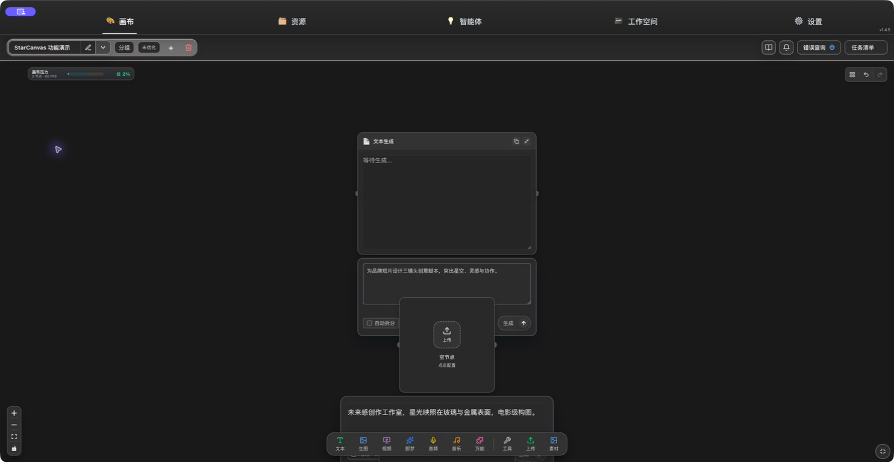
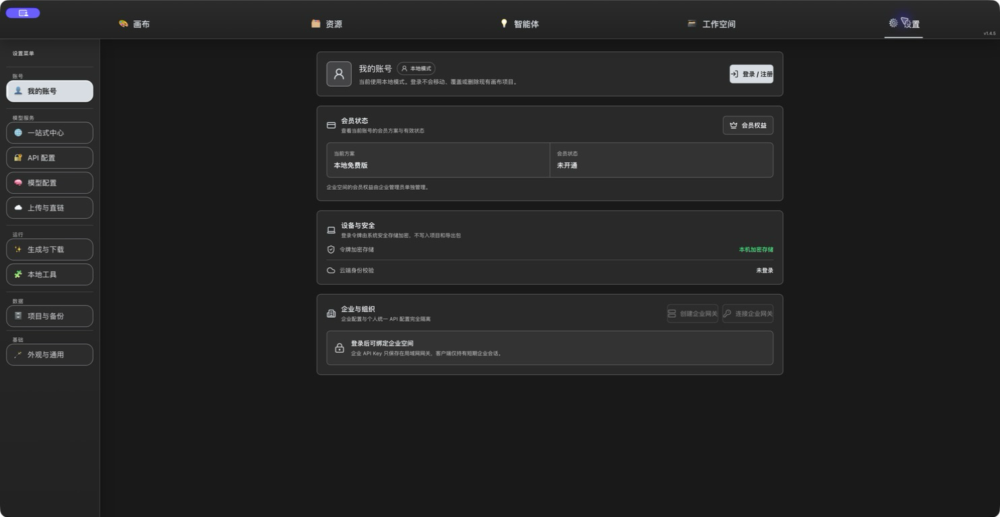
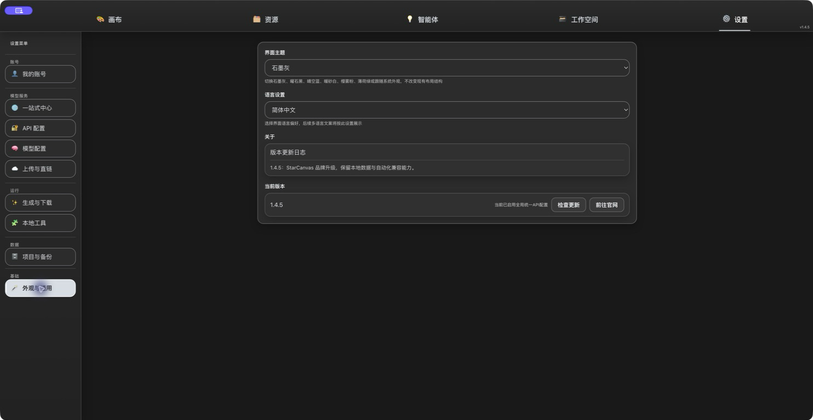

# StarCanvas

<div align="center">



**面向 AI 创作流程的桌面画布应用**

[](https://github.com/Guan-XX003/StarCanvas/releases)
[](#安装)
[](LICENSE)

[下载最新版](../../releases/latest) · [功能介绍](#代表功能) · [快速开始](#从源码运行) · [更新记录](CHANGELOG.md)

</div>

---

## ✨ 项目简介

StarCanvas是一款强大的本地桌面 AI 创作工作台，专为现代 AI 创作者设计。它将文本、图像、视频、音频、智能体和项目资料整合到一个统一的画布环境中，让你轻松构建、管理和优化完整的 AI 生成链路。

### 🎯 核心价值

- **🎨 流程可视化** — 把提示词、参考素材、生成结果和后处理节点连成可编辑的创作流程图
- **📦 素材可复用** — 统一管理所有媒体资源，告别反复下载、复制和找文件的困扰
- **⚙️ 配置可迁移** — 集中管理模型服务、API 配置、智能体知识和本地工具，便于长期项目维护
- **👥 团队协作** — 1.3.0+ 全新工作区功能，支持团队项目分享和协作
- **🔧 离线工具包** — 内置扩展工具安装管理，支持本地媒体处理和增强功能

### 💎 适用场景

- AI 图像/视频生成与编辑工作流
- 多模型创作实验与提示词迭代
- 创意项目的素材管理与组织
- 智能体辅助的内容策划与生成
- 团队协作的 AI 创作项目管理

---

## 🚀 代表功能

### 📐 节点式画布
基于 XYFlow 的可视化编辑器，支持文本、图片、视频、音频、音乐等多种创作节点，轻松搭建复杂的多步骤 AI 工作流。


### 📚 资源库
集中查看和管理所有生成与导入的素材，支持类型筛选、来源筛选、收藏、下载和一键复用到画布。

### 🤖 智能体工作台
为不同任务创建专属 AI 智能体，绑定特定模型、角色设定和知识库，通过对话整理创意、优化提示词。

### ✅ 任务清单
统一追踪所有异步生成任务，实时查看进度、刷新结果、处理失败任务，保持创作流程井然有序。

### 👥 工作区协作 `v1.3.0 新增`
团队项目管理功能，支持：
- 创建和管理团队工作区
- 项目分享与协作
- 成员权限管理
- 跨设备同步

### 🛠️ 离线工具包 `v1.3.0 新增`
内置扩展工具安装器，支持：
- ffmpeg 视频处理
- Qwen-TTS 本地语音合成
- Real-ESRGAN 图像增强
- Deface 人脸模糊处理
- 一键安装，跨平台支持

### ⚙️ 模型与 API 配置
通过配置管家维护 Base URL、API Key、模型列表和协议映射，灵活适配各类中转站和模型服务。

### 🎬 即梦 / Seedance 工作流
完整的视频生成链路，支持：
- 参考图/参考视频上传
- 天玑（Tianji）人像素材库
- 多种上传通道（临时链接、火山引擎 TOS、七牛等）
- 视频生成任务追踪

### 💾 项目与备份
支持项目切换、分组管理、导入导出、备份中心和跨设备迁移，保障长期项目的数据安全。

### 👤 账号与会员
本地模式可直接开始创作；登录后可使用云端提示词库、企业网关和会员权益管理。



### 🎨 外观与主题
自定义主题、语言（简体中文、繁体中文、English）、个性化描述和界面设置。



---

## 📥 安装

### 支持平台

| 平台 | 架构 | 下载 |
|------|------|------|
| macOS | Apple Silicon (arm64) | [StarCanvas-1.4.5-arm64.dmg](https://github.com/Guan-XX003/StarCanvas/releases/download/v1.4.5-release/StarCanvas-1.4.5-arm64.dmg) |
| Windows | x64 | [StarCanvas-1.4.5-x64.exe](https://github.com/Guan-XX003/StarCanvas/releases/download/v1.4.5-release/StarCanvas-1.4.5-x64.exe) |

CLI / MCP 独立下载：[starcanvas-cli-1.4.5.zip](https://github.com/Guan-XX003/StarCanvas/releases/download/v1.4.5-release/starcanvas-cli-1.4.5.zip)

### 安装说明

**macOS:**
1. 下载 `.dmg` 文件
2. 双击打开，拖动到应用程序文件夹
3. 首次打开如遇安全提示，右键点击应用图标选择「打开」

**Windows:**
1. 下载对应架构的 `.exe` 安装器
2. 运行安装程序，按提示完成安装
3. 如遇 SmartScreen 提示，确认来源后继续

---

## 🛠️ 从源码运行

### 环境要求
- Node.js 16+
- npm 或 pnpm

### 开发运行

```bash
# 克隆仓库
git clone https://github.com/Guan-XX003/StarCanvas.git
cd StarCanvas

# 安装依赖
npm install

# 启动开发模式
npm start

# 或者启动开发服务器
npm run start:dev

# 调试模式
npm run debug
```

### 构建安装包

```bash
# 构建当前平台
npm run build

# 构建 Windows 全架构（x64 + x86）
npm run build:win

# 单独构建 Windows x64
npm run build:win:x64

# 单独构建 Windows x86
npm run build:win:x86
```

构建产物输出到 `release/` 目录。

---

## 🏗️ 技术栈

| 技术 | 用途 |
|------|------|
| [Electron](https://www.electronjs.org/) | 跨平台桌面应用框架 |
| [React 19](https://react.dev/) | UI 框架 |
| [Vite](https://vitejs.dev/) | 构建工具 |
| [TypeScript](https://www.typescriptlang.org/) | 类型安全 |
| [Zustand](https://zustand-demo.pmnd.rs/) | 状态管理 |
| [XYFlow](https://reactflow.dev/) | 节点画布引擎 |
| [GSAP](https://greensock.com/gsap/) | 动画库 |
| [Lucide](https://lucide.dev/) | 图标库 |

---

## 📋 更新记录

### 最新版本：v1.4.5（2026-08-15）

- 修复生成图片节点编辑保存时报错、旧缩略图覆盖编辑结果及下游引用旧图的问题
- 编辑区域支持普通鼠标滚轮直接缩放图片，编辑结果会落盘为项目本地素材

### 历史版本：v1.4.3（2026-08-14）
- 修复天玑已审核虚拟人像在画布手动生成时混入普通图片引用的问题
- 虚拟人像素材支持本地预览图，官方未返回预览时仍可识别和管理素材
- CLI/MCP 新增 `--portrait-asset-id` / `portraitAssetIds` 严格已审核人像入口，未审核普通图片不会进入该通道
- 保持方舟官方兼容模式的素材审核与生成逻辑不变
- 我的账号新增会员权益介绍，展示企业模型管理、云端提示词库与极鑫中转站折扣

### 历史版本：v1.4.2（2026-08-13）

- 云端提示词库、跨空间发送、团队成员与邀请、离线同步与冲突处理
- 天玑 v2、人像素材库兼容、CLI/MCP 天玑控制和媒体结果本地持久化
- 本地模式默认启动、开屏启动体验、长名称与旧素材删除兼容修复

### 历史版本：v1.3.5（2026-06-29）

- 🌐 在更新设置旁新增“前往官网”入口
- 🛡️ 正式版忽略开发数据目录变量，避免误读临时开发数据

### v1.3.4（2026-06-27）

- 📦 发布 macOS 与 Windows 正式安装包
- 📜 明确项目非商业使用许可

### v1.3.3（2026-06-26）
- 🎨 优化石墨灰主题控件配色、边界和选中态
- 🌐 新增内置语言包运行时，覆盖更多后渲染界面
- 🛠️ 完善 Deface 官方离线运行时打包与校验流程
- 💡 优化工作空间和功能提示词卡片布局

### v1.3.2（2026-06-24）
- 🎨 增强画布渲染性能和交互体验
- 🔧 改进天玑配置同步机制
- 🐛 修复多个稳定性问题

### v1.3.1（2026-06-23）
- 👥 完善工作区团队协作功能
- 🔧 优化天玑 API 调用逻辑
- 🐛 修复工作区项目加载问题

### v1.3.0（2026-06-22）
- ✨ **重大更新**：全新工作区和团队协作功能
- 🛠️ 新增离线工具包管理系统
- 🎨 优化启动主题和界面体验
- 📦 增强扩展工具安装器

[查看完整更新记录 →](CHANGELOG.md)

---

## 🔒 数据与隐私

StarCanvas在本地保存所有项目数据、配置、任务记录和媒体素材，**不会上传任何用户数据到云端**。

### 数据存储位置
- **macOS**: `~/Library/Application Support/wanjuan-lingjing/`
- **Windows**: `%APPDATA%/wanjuan-lingjing/`

### 安全提示
- 所有 API Key 仅存储在本地
- 媒体文件默认保存在用户指定的本地目录
- 项目备份支持加密导出

---

## 💬 反馈与支持

遇到问题或有功能建议？欢迎通过以下方式联系：

- 📝 [提交 Issue](../../issues)
- 💡 [功能建议](../../discussions)
- 📧 邮件反馈

**提交问题时请说明：**
- 应用版本
- 操作系统和版本
- 问题复现步骤
- 相关错误提示截图

---

## 📜 许可与声明

本项目采用 [PolyForm Noncommercial License 1.0.0](LICENSE) 授权。

允许个人学习、研究、非商业使用和非商业二次开发。未经作者书面授权，禁止将本项目或其衍生版本用于商业销售、商业部署、SaaS 服务、付费分发、商业集成或其他营利性用途。

本项目在创作工作流理念上曾参考一毛画布等同类工具的使用体验，但软件源码、桌面端架构、界面组织和当前功能实现均由本项目独立开发完成。

**本项目主要目的：**
- 提供独立桌面应用的创作体验
- 支持自定义中转站和模型配置
- 方便本地化和扩展功能

---

## ⭐ Star History

如果这个项目对你有帮助，欢迎给个 Star ⭐️

---

<div align="center">

**Made with ❤️ for AI Creators**

[返回顶部](#starcanvas)

</div>
