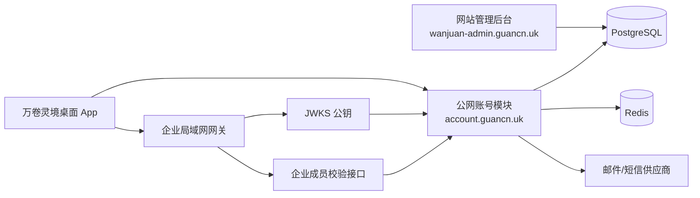

# 万卷灵境账号与网站管理后台落地设计

## 0. 给后台开发会话的执行说明

请在现有万卷网站管理后台源码中直接实现本文档，不要只输出方案或伪代码。开始前先读取现有项目的技术栈、数据库、Directus 配置、部署方式和通知模块，沿用既有工程规范。

最终交付必须包括：

1. 数据库迁移与初始化数据。
2. 公网账号接口及 OpenAPI 文档。
3. 网站管理后台的用户、会员、设备、邀请码、企业和审计页面。
4. 邮箱验证码发送适配器及开发环境模拟适配器。
5. Access Token、Refresh Token、轮换、撤销和 JWKS 验签能力。
6. 自动化接口测试、权限测试和部署说明。
7. 可供万卷灵境 App 联调的测试账号、邀请码和生产接口地址。

实现完成后请实际启动后台，通过测试和浏览器检查管理页面，不要在未经验证的情况下宣布完成。

## 1. 项目目标

为万卷灵境桌面 App 提供可投入使用的账号管理模块，支持：

- 邮箱或手机号验证码注册、登录。
- 邀请码控制内测注册。
- 按设备管理登录会话。
- 免费版、专业版、团队版和企业版会员状态。
- 网站管理员手动开通、续期、暂停和取消会员。
- 企业组织、成员和局域网私密空间身份。
- 管理员审计和账号风控。
- App 离线时的短期登录宽限。

本阶段不实现：

- 极鑫模型余额、钱包、积分和消费流水。
- 在线支付、自动续费、退款和发票。
- 云项目同步、团队项目协作和文件存储。
- 企业模型代理和企业 API Key 管理。

账号模块只管理身份、会员、设备和企业成员关系。企业 API Key 必须留在企业局域网网关，不得进入网站管理后台、账号响应或 App。

## 2. 现有系统与部署关系

建议使用以下部署结构：



当前 `wanjuan-admin.guancn.uk` 已有 Directus 风格接口，例如 `/items/app_notifications`。可以继续使用 Directus 作为管理面和数据管理工具，但 App 不得直接使用 Directus 登录接口或 Directus Token。

推荐实现方式：

- Directus：管理页面、数据维护、管理员角色与权限。
- 独立账号模块：验证码、登录、JWT、Refresh Token、会话轮换和公开账号接口。
- PostgreSQL：账号业务数据。
- Redis：验证码、发送冷却、尝试次数和接口限流。
- 反向代理：将 `https://account.guancn.uk` 转发到账号模块。

如果现有后台不是 Directus 扩展式架构，可以使用项目已有的 Node.js、Go、Java 或其他服务端框架实现，但公开接口和数据约束必须保持一致。

## 3. 模块划分

### 3.1 Identity 模块

负责：

- 邮箱和手机号标准化。
- 验证码发送与校验。
- 用户注册、登录和禁用检查。
- 防止通过接口枚举已注册账号。

### 3.2 Session 模块

负责：

- 签发短期 Access Token。
- 签发并轮换 Refresh Token。
- 按设备保存会话。
- 单设备撤销和全部设备退出。
- 检测 Refresh Token 重放。

### 3.3 Membership 模块

负责：

- 会员方案和权益。
- 用户会员状态和到期时间。
- 管理员手动开通、续期、暂停和取消。
- 为 App 的 `/me` 响应提供 `subscription` 和 `entitlements`。

### 3.4 Organization 模块

负责：

- 企业组织、管理员和成员。
- 企业邀请码。
- 企业局域网网关的成员身份校验。
- 成员禁用和角色调整。

### 3.5 Admin Audit 模块

负责记录所有管理员操作和高风险账号操作，不记录验证码、Token、API Key 或用户项目内容。

## 4. 数据库设计

所有时间统一保存为 UTC，接口返回 ISO 8601。业务表不要直接复用 `directus_users`，避免 App 用户获得后台身份。

### 4.1 `app_users`

| 字段 | 类型 | 说明 |
| --- | --- | --- |
| `id` | UUID PK | 用户 ID，接口中使用 `usr_` 前缀或 UUID 均可，但必须稳定 |
| `status` | enum | `active`、`disabled`、`deleted` |
| `display_name` | varchar | 显示名称 |
| `avatar_url` | varchar nullable | 头像地址 |
| `locale` | varchar | 默认 `zh-CN` |
| `last_login_at` | timestamptz nullable | 最近登录时间 |
| `created_at` | timestamptz | 创建时间 |
| `updated_at` | timestamptz | 更新时间 |

### 4.2 `app_user_identities`

| 字段 | 类型 | 说明 |
| --- | --- | --- |
| `id` | UUID PK | 身份记录 ID |
| `user_id` | UUID FK | 关联 `app_users` |
| `type` | enum | `email`、`phone` |
| `identifier` | varchar | 标准化邮箱或 E.164 手机号，唯一索引 |
| `verified_at` | timestamptz | 验证时间 |
| `created_at` | timestamptz | 创建时间 |

邮箱保存前转小写并去除首尾空格。手机号必须转为 E.164 格式。不要仅依赖前端进行标准化。

### 4.3 `app_verification_codes`

| 字段 | 类型 | 说明 |
| --- | --- | --- |
| `id` | UUID PK | 验证记录 ID |
| `identifier_hash` | varchar | 标准化身份的 HMAC，不保存明文日志 |
| `purpose` | enum | `login`、`register` |
| `code_hash` | varchar | 验证码哈希，不保存明文 |
| `expires_at` | timestamptz | 5 分钟后失效 |
| `consumed_at` | timestamptz nullable | 使用后写入 |
| `attempt_count` | integer | 最多 5 次 |
| `created_at` | timestamptz | 创建时间 |

验证码的快速状态可以放 Redis，数据库用于安全审计。后台管理页面默认不展示本表。

### 4.4 `app_devices`

| 字段 | 类型 | 说明 |
| --- | --- | --- |
| `id` | UUID PK | 设备 ID |
| `user_id` | UUID FK | 用户 |
| `device_fingerprint` | varchar | 客户端生成的稳定设备标识哈希 |
| `name` | varchar | 例如 `MacBook Pro` |
| `platform` | varchar | `darwin`、`win32` |
| `last_seen_at` | timestamptz | 最近活跃时间 |
| `revoked_at` | timestamptz nullable | 设备撤销时间 |
| `created_at` | timestamptz | 首次登录时间 |

### 4.5 `app_sessions`

| 字段 | 类型 | 说明 |
| --- | --- | --- |
| `id` | UUID PK | 会话 ID，写入 JWT `sid` |
| `user_id` | UUID FK | 用户 |
| `device_id` | UUID FK | 设备 |
| `token_family_id` | UUID | Refresh Token 轮换族 |
| `refresh_token_hash` | varchar | Refresh Token 哈希 |
| `expires_at` | timestamptz | 会话到期时间 |
| `rotated_at` | timestamptz nullable | 最近轮换时间 |
| `revoked_at` | timestamptz nullable | 撤销时间 |
| `last_used_at` | timestamptz | 最近使用时间 |
| `created_at` | timestamptz | 创建时间 |

发现已使用的旧 Refresh Token 再次出现时，撤销同一 `token_family_id` 下的所有会话并写入审计日志。

### 4.6 `app_plans`

| 字段 | 类型 | 说明 |
| --- | --- | --- |
| `id` | varchar PK | `free`、`pro`、`team`、`enterprise` |
| `name` | varchar | 中文显示名称 |
| `status` | enum | `active`、`inactive` |
| `device_limit` | integer | 最大登录设备数 |
| `sort` | integer | 显示排序 |

### 4.7 `app_entitlements`

首期初始化：

| `key` | 说明 |
| --- | --- |
| `cloud_backup` | 云备份，功能未开发时可以先关闭 |
| `multi_device_sync` | 多设备同步，功能未开发时可以先关闭 |
| `enterprise_workspace` | 企业私密空间 |

配套关系表 `app_plan_entitlements(plan_id, entitlement_key, enabled)`。

### 4.8 `app_subscriptions`

| 字段 | 类型 | 说明 |
| --- | --- | --- |
| `id` | UUID PK | 会员记录 ID |
| `user_id` | UUID FK | 用户 |
| `plan_id` | varchar FK | 会员方案 |
| `status` | enum | `active`、`trialing`、`paused`、`expired`、`cancelled` |
| `starts_at` | timestamptz | 开始时间 |
| `expires_at` | timestamptz nullable | 为空表示长期有效 |
| `source` | enum | 首期使用 `admin`、`invite`、`migration` |
| `created_by` | UUID nullable | 操作管理员 |
| `updated_at` | timestamptz | 更新时间 |

同一用户只能有一条当前生效会员。历史变更可以保留记录，但 `/me` 只返回当前有效方案。

### 4.9 `app_invite_codes`

| 字段 | 类型 | 说明 |
| --- | --- | --- |
| `id` | UUID PK | 邀请记录 ID |
| `code_hash` | varchar | 邀请码哈希 |
| `code_prefix` | varchar | 后台列表只显示前缀 |
| `purpose` | enum | `register`、`organization` |
| `default_plan_id` | varchar nullable | 注册后默认会员 |
| `organization_id` | UUID nullable | 企业邀请时使用 |
| `max_uses` | integer | 最大使用次数 |
| `used_count` | integer | 已使用次数 |
| `expires_at` | timestamptz nullable | 到期时间 |
| `enabled` | boolean | 是否启用 |
| `created_by` | UUID | 创建管理员 |

邀请码创建后只显示一次完整明文，数据库只保存哈希。

### 4.10 `app_organizations`

| 字段 | 类型 | 说明 |
| --- | --- | --- |
| `id` | UUID PK | 企业 ID |
| `name` | varchar | 企业名称 |
| `status` | enum | `active`、`suspended` |
| `gateway_id` | varchar nullable | 局域网网关标识 |
| `created_at` | timestamptz | 创建时间 |

### 4.11 `app_organization_members`

| 字段 | 类型 | 说明 |
| --- | --- | --- |
| `organization_id` | UUID FK | 企业 |
| `user_id` | UUID FK | 用户 |
| `role` | enum | `owner`、`admin`、`member` |
| `status` | enum | `active`、`disabled` |
| `expires_at` | timestamptz nullable | 成员有效期 |
| `created_at` | timestamptz | 加入时间 |

`organization_id + user_id` 建立唯一索引。

### 4.12 `app_audit_logs`

记录：管理员、操作类型、对象类型、对象 ID、时间、结果、IP 哈希和必要的非敏感差异。禁止记录验证码、Access Token、Refresh Token、邀请码明文、企业 API Key。

## 5. 公网账号接口契约

生产地址建议：

```text
https://account.guancn.uk
```

所有接口使用 JSON。错误响应统一为：

```json
{
  "error": "用户可理解的中文错误",
  "code": "STABLE_MACHINE_CODE"
}
```

不要把数据库错误、堆栈、供应商响应或 Token 内容返回客户端。

### 5.1 `POST /auth/send-code`

请求：

```json
{
  "identifier": "user@example.com",
  "purpose": "login"
}
```

`purpose` 只允许 `login` 或 `register`。

成功：

```json
{
  "ok": true,
  "expiresIn": 300,
  "retryAfter": 60
}
```

规则：

- 6 位数字验证码，5 分钟有效。
- 相同身份 60 秒内只能发送一次。
- 每个身份每小时最多 8 次，每个 IP 每小时最多 30 次。
- 校验最多尝试 5 次。
- 对不存在的登录账号仍返回相同结构，防止账号枚举。
- 开发环境使用模拟适配器，验证码固定但只能在非生产环境启用。

### 5.2 `POST /auth/register`

请求：

```json
{
  "identifier": "user@example.com",
  "code": "123456",
  "inviteCode": "WANJUAN-XXXX",
  "deviceName": "MacBook Pro"
}
```

执行顺序：

1. 验证邀请码有效、未过期且未超次数。
2. 验证验证码。
3. 创建用户与身份。
4. 创建或复用设备记录。
5. 按邀请码开通默认会员。
6. 消费邀请码次数。
7. 签发会话。

以上操作必须在一个数据库事务中完成。

### 5.3 `POST /auth/login`

请求：

```json
{
  "identifier": "user@example.com",
  "code": "123456",
  "deviceName": "Windows PC"
}
```

禁用用户返回 `403 ACCOUNT_DISABLED`。超过当前会员设备数量时返回 `409 DEVICE_LIMIT_REACHED`，并提示用户先在管理后台或已有设备中撤销旧设备。

### 5.4 登录与注册响应

```json
{
  "accessToken": "short-lived-jwt",
  "refreshToken": "opaque-random-token",
  "user": {
    "id": "usr_123",
    "name": "用户",
    "email": "user@example.com",
    "phone": ""
  },
  "subscription": {
    "plan": "pro",
    "status": "active",
    "expiresAt": "2026-12-31T23:59:59Z"
  },
  "entitlements": ["enterprise_workspace"],
  "device": {
    "id": "dev_123",
    "name": "MacBook Pro",
    "platform": "darwin"
  }
}
```

`wallet` 不再需要，可以不返回或返回 `null`。不得返回会员后台备注、管理员 ID、Token 哈希或企业密钥。

### 5.5 `POST /auth/refresh`

请求：

```json
{
  "refreshToken": "opaque-random-token"
}
```

响应返回新的 Access Token、Refresh Token 和最新用户状态。Refresh Token 必须轮换，旧 Token 使用后立即失效。

建议有效期：

- Access Token：15 分钟。
- Refresh Token：30 天。
- App 离线宽限：客户端当前为最近一次成功校验后的 72 小时，但受保护操作仍必须由服务端重新验证。

### 5.6 `GET /me`

Header：

```text
Authorization: Bearer <accessToken>
```

返回与登录响应相同的 `user`、`subscription`、`entitlements` 和 `device`，不需要返回 Token。

每次调用时必须重新检查：

- 用户是否禁用。
- 会话是否撤销。
- 设备是否撤销。
- 会员是否到期。
- 企业成员状态是否变化。

### 5.7 `POST /auth/logout`

根据 Access Token 的 `sid` 撤销当前会话，返回：

```json
{ "ok": true }
```

重复调用保持幂等。

### 5.8 `GET /.well-known/jwks.json`

提供企业局域网网关验证 Access Token 的公钥。私钥只存在于 KMS、Secret Manager 或服务器安全文件中，不得进入数据库和管理后台。

JWT 必须至少包含：

```json
{
  "iss": "https://account.guancn.uk",
  "aud": "wanjuan-desktop",
  "sub": "usr_123",
  "sid": "session_uuid",
  "did": "device_uuid",
  "iat": 0,
  "exp": 0
}
```

建议使用 Ed25519 或 RS256，并包含 `kid` 以支持密钥轮换。

### 5.9 企业成员内部校验接口

企业网关验证 JWT 后，还必须确认用户当前仍属于该企业。提供仅供企业网关调用的接口：

```text
GET /internal/organizations/:organizationId/members/:userId
```

使用 mTLS 或独立 Gateway Service Token 鉴权。响应：

```json
{
  "active": true,
  "organization": {
    "id": "org_123",
    "name": "示例企业"
  },
  "role": "member",
  "expiresAt": null
}
```

不要把企业 API Key 或企业模型上游地址放入响应。

## 6. 网站管理后台页面

后台 UI 沿用现有网站设计系统，面向高频管理操作，使用表格、筛选、抽屉和确认弹窗，不制作营销式卡片页面。

### 6.1 用户管理

列表字段：

- 用户 ID。
- 邮箱或手机号。
- 显示名称。
- 账号状态。
- 当前会员。
- 会员到期时间。
- 设备数量。
- 企业名称。
- 最近登录时间。
- 注册时间。

筛选：账号状态、会员方案、企业、注册时间、最后登录时间。

用户详情页或抽屉：

- 基本身份。
- 当前会员。
- 登录设备和会话。
- 企业成员关系。
- 最近审计记录。

操作：

- 修改显示名称。
- 禁用或恢复账号。
- 强制退出全部设备。
- 单独撤销设备。
- 手动开通或修改会员。
- 添加或移除企业成员。

禁用账号、强制退出、移除企业管理员需要二次确认并写入审计日志。

### 6.2 会员方案

显示免费版、专业版、团队版、企业版及其状态、设备限制和权益。首期不展示价格和模型余额。

管理员可以：

- 开通会员到指定日期。
- 延长指定天数。
- 暂停、恢复或取消。
- 查看变更历史。

修改方案定义不应追溯修改已经失效的历史会员记录。

### 6.3 设备与会话

显示设备名称、平台、最近活跃、会话到期、IP 区域摘要和撤销状态。不得展示 Refresh Token。

支持：

- 撤销单个设备。
- 撤销当前用户全部设备。
- 标记异常登录并写入审计日志。

### 6.4 注册邀请码

支持创建、停用和查看使用情况。创建时选择：

- 注册或企业邀请。
- 默认会员方案。
- 企业组织。
- 有效期。
- 最大使用次数。

完整邀请码只在创建成功后展示一次，并提供复制按钮。

### 6.5 企业与组织

列表字段：企业名称、状态、管理员、成员数量、网关标识、创建时间。

企业详情：

- 成员表格。
- 邀请码。
- 成员角色和有效期。
- 局域网网关标识。
- 最近成员校验和管理审计。

后台只管理身份关系，不上传、保存或展示企业 API Key。

### 6.6 审计日志

支持按管理员、用户、企业、操作类型和时间筛选。日志不可由普通运营人员删除。

## 7. 后台角色与权限

建议至少配置：

| 角色 | 权限 |
| --- | --- |
| `super_admin` | 全部权限、方案配置、管理员权限配置 |
| `member_admin` | 用户、会员、设备、邀请码和企业成员管理 |
| `support` | 只读用户信息，可撤销设备，不可修改企业管理员和会员方案定义 |
| `auditor` | 只读审计日志和统计 |

公开 App 用户永远不能获得 Directus 管理后台角色。

## 8. 安全与风控要求

- 生产环境强制 HTTPS 和 HSTS。
- 验证码、邀请码、Refresh Token 均只保存哈希。
- Access Token 私钥不得放入 Git、数据库或管理后台字段。
- 登录、验证码、刷新接口必须限流。
- 后台修改会员、禁用用户和修改企业管理员必须记录审计日志。
- 日志屏蔽 Authorization、Cookie、验证码和请求正文中的敏感字段。
- 数据库连接、邮件密钥和 JWT 私钥通过环境变量或 Secret Manager 提供。
- 数据库每日备份并验证恢复流程。
- 管理后台必须启用独立管理员认证，建议增加 MFA。

## 9. 环境变量

命名可以按现有后台规范调整，但必须覆盖以下能力：

```dotenv
ACCOUNT_PUBLIC_URL=https://account.guancn.uk
ACCOUNT_DATABASE_URL=postgresql://...
ACCOUNT_REDIS_URL=redis://...
ACCOUNT_JWT_ISSUER=https://account.guancn.uk
ACCOUNT_JWT_AUDIENCE=wanjuan-desktop
ACCOUNT_JWT_PRIVATE_KEY_FILE=/run/secrets/account-jwt-private.pem
ACCOUNT_JWT_KEY_ID=wanjuan-account-2026-01
ACCOUNT_ACCESS_TOKEN_TTL_SECONDS=900
ACCOUNT_REFRESH_TOKEN_TTL_SECONDS=2592000
ACCOUNT_OTP_TTL_SECONDS=300
ACCOUNT_OTP_COOLDOWN_SECONDS=60
ACCOUNT_OTP_PROVIDER=resend
ACCOUNT_OTP_FROM=account@guancn.uk
ACCOUNT_OTP_PROVIDER_KEY=...
ACCOUNT_IDENTIFIER_HMAC_SECRET=...
ACCOUNT_GATEWAY_SERVICE_SECRET=...
```

开发环境另设：

```dotenv
ACCOUNT_DEV_FIXED_CODE=123456
ACCOUNT_ALLOW_FIXED_CODE=true
```

生产环境启动时如果发现 `ACCOUNT_ALLOW_FIXED_CODE=true`，必须拒绝启动。

## 10. 初始化数据

迁移后初始化：

```text
free       本地免费版   device_limit=2
pro        专业版       device_limit=5
team       团队版       device_limit=10
enterprise 企业版       device_limit=20
```

首期只有 `enterprise_workspace` 可以标记为已具备真实服务能力。尚未完成的 `cloud_backup` 和 `multi_device_sync` 可以保留定义但不要向生产用户下发，避免 UI 暗示功能已经上线。

创建一个仅限联调环境的测试用户和邀请码，生产环境不得使用固定验证码或公共测试邀请码。

## 11. 自动化测试

### 11.1 接口测试

- 发送登录验证码成功。
- 冷却期间重复发送被限流。
- 错误验证码失败且尝试次数增加。
- 过期验证码失败。
- 验证码只能消费一次。
- 无效、过期和超次数邀请码注册失败。
- 注册事务失败时不残留用户、会员或邀请码计数。
- 登录返回符合 App 契约的响应。
- 禁用用户无法登录和刷新。
- Refresh Token 成功轮换。
- 旧 Refresh Token 重放会撤销整个 Token Family。
- 撤销设备后 `/me` 和刷新均失败。
- 会员到期后 `/me` 返回非 `active` 状态和正确权益。
- JWKS 可以验证 Access Token。
- 企业内部接口拒绝无效 Gateway Service Token。

### 11.2 管理后台测试

- 用户搜索、筛选和分页正常。
- 手动开通会员后 `/me` 立即反映新状态。
- 禁用用户后现有会话失效。
- 撤销单设备不影响其他设备。
- 创建邀请码只显示一次明文。
- 修改企业角色后内部成员校验接口立即更新。
- 权限较低的后台角色不能修改方案或企业管理员。
- 所有高风险操作产生审计日志。

### 11.3 App 联调测试

使用万卷灵境源码运行：

```bash
WANJUAN_ACCOUNT_API_URL=https://account-staging.guancn.uk npm start
```

验证：

- 首次启动可以注册和登录。
- 验证码错误有中文提示。
- 登录后显示正确会员方案和状态。
- 不显示极鑫模型余额。
- 退出登录不删除本地项目。
- 重启 App 后 Refresh Token 自动恢复会话。
- 后台撤销设备后 App 下次刷新进入离线或重新登录状态。
- 企业成员可以绑定局域网网关，非成员不能绑定。

## 12. 部署与发布顺序

1. 在测试数据库执行迁移和初始化数据。
2. 部署账号模块到 `account-staging.guancn.uk`。
3. 配置测试邮件供应商和 Redis。
4. 完成接口测试和管理后台权限测试。
5. 使用万卷灵境源码连接测试环境联调。
6. 生成生产 JWT 密钥并放入 Secret Manager。
7. 部署 `account.guancn.uk`，配置 TLS、WAF、限流和监控。
8. 向 App 开发侧交付生产地址、JWKS 地址和测试结果。
9. App 内置生产账号地址后再发布正式版。

数据库迁移必须可回滚。上线时先允许少量测试邀请码，不立即开放公众注册。

## 13. 监控与告警

至少监控：

- 验证码发送成功率和供应商错误率。
- 登录成功率、401、403、429 数量。
- Refresh Token 重放事件。
- 数据库和 Redis 连接状态。
- `/me` 和 `/auth/refresh` P95 延迟。
- 管理后台高风险操作。
- 企业成员校验接口失败率。

不采集用户验证码、Token、完整手机号、完整邮箱或项目内容作为监控标签。

## 14. 验收标准

后台开发会话只有在以下条件全部满足后才能报告完成：

1. App 可以使用真实邮箱验证码注册和登录。
2. App 重启后可以通过轮换 Refresh Token 恢复会话。
3. 网站后台可以搜索用户、禁用用户和撤销设备。
4. 网站后台可以手动开通、续期和取消会员。
5. 用户会员变更能在 `/me` 中立即生效。
6. 注册邀请码有有效期、次数和默认会员控制。
7. 企业组织和成员可以在后台维护。
8. 企业网关能通过 JWKS 验证账号 Token 并查询成员状态。
9. 数据库不保存明文验证码、Refresh Token、邀请码或企业 API Key。
10. 自动化测试全部通过，并附带接口测试结果和管理后台截图。

## 15. 与万卷灵境 App 的衔接事项

App 当前已经完成登录 UI、主进程安全存储、会话刷新和企业网关绑定。后台实现时不要要求 App 保存网站 Cookie，也不要把 Directus Token 返回 App。

后台交付后，App 侧还需要单独完成一项发布配置：在正式发行包中内置 `https://account.guancn.uk`，并保留 `WANJUAN_ACCOUNT_API_URL` 作为开发环境覆盖值。

后台会话完成实现后，请向 App 开发会话提供：

- 测试环境账号接口地址。
- 生产账号接口地址。
- JWKS 地址。
- 测试账号或一次性测试邀请码。
- OpenAPI 文档。
- 数据库迁移版本。
- 已通过的自动化测试清单。
- 仍未启用的权益列表。
