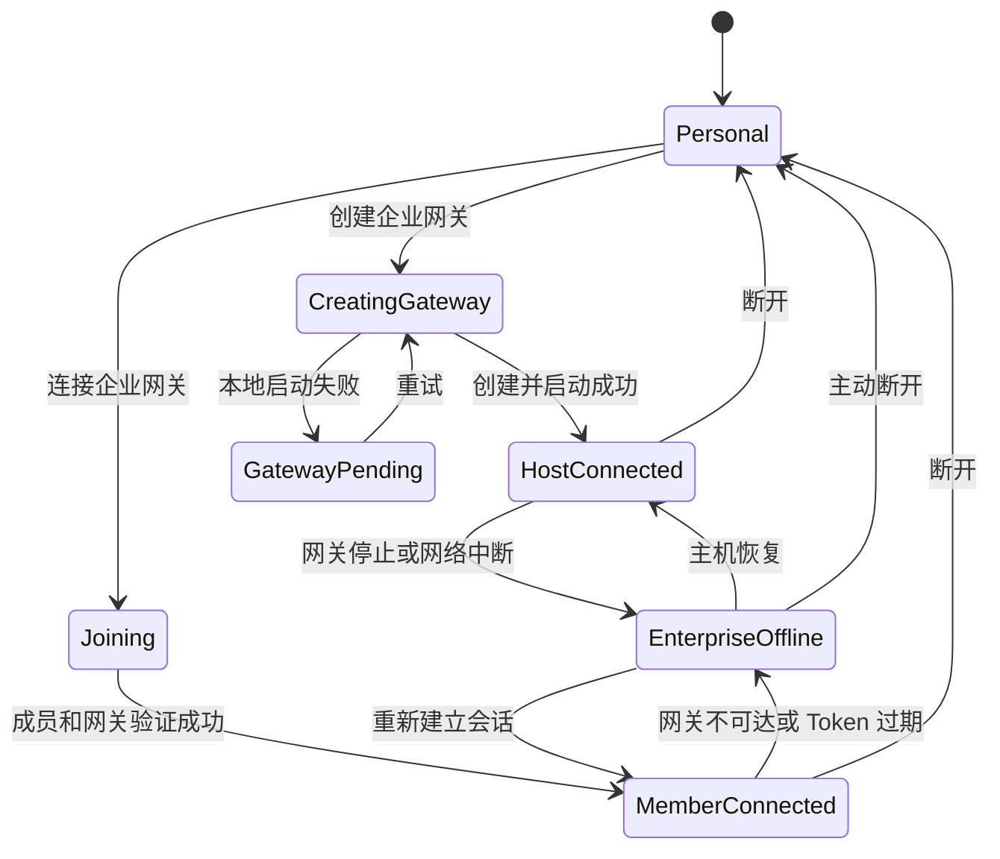

# 万卷灵境 App 企业本机网关落地方案

## 1. 文档状态

- 目标版本：企业私密空间第一版
- 适用主线：Claude 工作区 `Lingjing-canvas`
- 当前状态：App 第三阶段基础链路已实现；标准协议执行器、远端取消和管理 UI 仍待后续阶段
- 配套服务器文档：`ENTERPRISE_LOCAL_GATEWAY_SERVER_IMPLEMENTATION.md`

本文档定义 App 端的产品交互、运行时配置隔离、本机网关生命周期、成员管理、配额展示、节点调用方式和测试验收标准。

### 1.1 2026-07-22 已落地基线

- “我的账号”已加入创建企业网关与连接企业网关入口。
- 已实现四步创建向导：企业信息、配置镜像、默认配额和创建结果。
- 已实现企业设置白名单快照、递归 Secret 提取和 `secretRef` 替换。
- 已实现本机加密 Vault、Ed25519 网关身份、自签名 TLS 证书和 HTTPS 健康检查。
- 已接入 `/organizations/self-hosted`、网关激活和企业邀请码的 App 端编排。
- 普通成员绑定后，API 配置、模型配置、上传与直链入口原生锁定；网关主机保留编辑和同步能力。
- 已增加本机网关与账号编排自动测试。

### 1.2 2026-07-22 第二阶段进度

- 已完成生产 Gateway Grant、账号 Access Token 和 RS256/JWKS 校验。
- 已完成证书指纹 pinning、Workspace Session、加密 Workspace Token 和配置快照缓存。
- 已完成成员配置覆盖层；企业配置不会写入或覆盖个人 IndexedDB，断开后清除企业缓存并恢复个人配置。
- 已完成统一桌面 `proxy-fetch` 的企业路由桥：匹配企业 API 地址的提交、轮询和结果请求由创建者电脑注入 Vault 密钥并代理。
- 成员请求只向网关传递鉴权头名称和方案，不传递个人密钥值；网关离线或代理失败时不会回退个人 API。
- 已覆盖 Bearer、`x-api-key`、Google API Key、越界目标拒绝、TLS 指纹错误、跨域重定向去密钥和离线不回退测试。

尚未完成：

- 完整 `ProtocolExecutor` 抽取；当前节点仍通过现有请求构造器和网关传输兼容层工作。
- `/workspace/tasks/{taskId}/cancel` 和 `/refresh` 的协议化远端操作。
- 上传供应商适配器的全链路流式传输；成员到网关已流式，部分既有供应商适配器仍会在创建者电脑读取临时文件。
- 图片多输出任务按实际成功张数结算；当前按一次成功任务结算。
- 成员列表、成员配额编辑和审计页面。

### 1.3 2026-07-22 第三阶段进度

- 已接入 `/workspace/uploads` 二进制流式通道，成员素材不再通过 Base64 JSON 传到创建者电脑。
- 现有公网临时链接、TOS、七牛和自定义直链 IPC 会自动切换到企业网关；失败时禁止回退个人上传配置。
- 网关从配置快照和 Vault 解析上传参数，成员端只发送通道、素材类型、文件名和 MIME。
- 已接入 `/workspace/tasks` 提交兼容层和 `/workspace/tasks/{taskId}` 查询。
- 网关任务账本只保存任务身份、模型、能力、上游任务 ID 和状态，不保存提示词、请求正文或密钥。
- GET 轮询会按上游任务 ID 更新网关任务状态；同步请求直接完成，失败和取消记录终态。
- 已实现 `clientRequestId` 幂等保护，重复提交不会再次请求上游。
- 已实现本机配额预占、成功结算、失败释放和任务 ID 幂等，并让 `/workspace/usage` 返回真实用量。

### 1.4 2026-07-23 账号服务器 API 1.3.0 对齐

- 创建自托管企业时会把向导中的 `defaultQuotas` 一并提交并由服务器原子落库。
- 网关每次控制平面同步后，使用 Ed25519 签名向 `/gateways/{gatewayId}/usage-summary` 上报当日绝对成功量和活动任务数。
- 用量上报只包含日期、能力计数和活动任务数，不包含提示词、媒体、任务正文或密钥。
- 创建者账号页已接入 owner/admin 成员列表、角色调整、禁用、恢复和移除。
- 创建者网关电脑可读取本机 `control-snapshot` 并编辑组织默认配额与成员覆盖策略。
- 非网关主机不伪造配额读取结果；服务器提供完整配额读取接口前，仅显示成员管理并提示在创建者电脑编辑配额。

## 2. 核心决策

### 2.1 创建者电脑是配置母机和请求网关

创建者电脑不是只保存几把 Key 的简化网关，而是企业配置的完整来源。创建网关时，App 复用现有“备份导出”序列化能力，把当前可用的以下设置打包成版本化企业配置快照：

- 统一 API 配置和已保存的全局批量配置。
- 模型列表、模型分类、模型与 API 绑定。
- 协议配置、字段映射、参数适配器和响应映射。
- 即梦、通义、音乐、音频等模型模块所需的运行参数。
- 上传与直链方式、文件限制和行为参数。

成员连接后，App 像“导入备份”一样把这份配置快照挂载到企业运行作用域，因此现有节点可以直接看到相同的模型、协议和参数，不需要成员重新配置。

唯一不同的是 Secret：

1. 创建者电脑启动局域网网关。
2. 完整配置结构保存在创建者电脑。
3. API Key、Token、AK/SK 和鉴权 Header 被提取到本机加密密钥库。
4. 分发给成员的快照在相同字段位置写入不可逆的 `secretRef`，而不是真实密钥。
5. 成员 App 使用完整配置结构渲染节点和参数，但真实请求、上传和轮询经过创建者电脑代理。

这样可以同时满足“连接后直接使用”和“成员电脑拿不到真实密钥”。

### 2.2 个人配置与企业配置使用独立作用域

绑定企业网关时，不覆盖、不清空、不改写用户原来的个人配置。

App 运行时只切换配置作用域：

```text
personal    用户自己的统一 API、模型、上传配置
enterprise 从创建者电脑镜像过来的完整企业配置快照
```

断开企业网关后，运行时指针切回 `personal`，用户看到的是绑定前原样保留的个人配置。企业配置快照、Secret 引用、模型清单和 Workspace Token 必须清除。

### 2.3 企业离线时禁止自动回退

绑定企业后，如果网关离线、主机休眠、Token 过期或离开局域网：

- 企业设置继续保持锁定。
- 企业节点停止生成并提示网关不可用。
- 不得自动使用个人 API 重试。
- 用户主动“断开企业网关”后才能恢复个人配置。

这是为了避免企业提示词、素材和任务被意外发送到个人供应商。

### 2.4 配额按成功结果结算

- 提交任务时只创建配额预占，不立即扣减。
- 成功任务结算配额。
- 失败、取消、超时和本地校验失败释放预占，不计入每日数量。
- 相同任务 ID 重复回调只结算一次。

### 2.5 复用备份模块，但不执行普通导入

企业配置同步必须复用现有备份模块的字段收集、版本迁移和兼容读取逻辑，避免出现“备份能恢复但企业网关缺字段”的两套实现。

新增两个模块：

```text
EnterpriseConfigSnapshotBuilder
  复用 buildBackupModules、normalizeBackupModules 和现有设置分区映射
  只选择 API、模型、协议、绑定、上传与直链等企业白名单字段
  提取 Secret 并替换为 secretRef
  生成版本号、校验摘要和配置 hash

EnterpriseConfigOverlay
  接收成员端快照
  以覆盖层方式向现有运行时提供相同字段结构
  不写入个人 chrome.storage、IndexedDB 或普通备份
```

不能直接调用普通“导入备份”，因为普通导入会永久覆盖个人配置，无法可靠断开恢复。

也不能把完整 `settings` 分区原样镜像给成员。现有备份设置还包含全局任务、下载目录、性能档位、通知和其他个人状态；企业快照构建器必须逐字段白名单收集，明确排除这些内容。

## 3. 用户角色

| 角色 | 能力 |
| --- | --- |
| 企业所有者/网关主机 | 创建网关；继续使用原设置页维护本机配置；同步配置快照；管理成员、配额和审计 |
| 企业管理员 | 管理成员和配额；只有在网关主机本机上才能编辑企业密钥配置 |
| 企业成员 | 连接网关、使用授权模型、查看自己的用量 |
| 已禁用成员 | 不能创建会话或提交任务 |

## 4. 入口与页面结构

在“设置 → 我的账号 → 企业与组织”保留当前区域，不新增顶级导航。

未绑定状态的头部操作改为两个平行按钮：

```text
[ 创建企业网关 ] [ 连接企业网关 ]
```

- `创建企业网关`：仅登录用户可用，需要企业创建权益。
- `连接企业网关`：已有企业邀请码和局域网网关地址的成员使用。
- 两个按钮使用当前主题变量，不写死背景色。
- 主按钮使用主题强调色，次按钮使用描边样式。
- 卡片圆角、边框、输入框和按钮尺寸沿用账号页面现有组件。

## 5. 创建企业网关流程

创建流程使用居中的多步骤 Dialog，不在现有卡片内继续嵌套卡片。

### 第一步：企业信息

字段：

- 企业名称，必填。
- 网关名称，默认“用户名的企业网关”。
- 企业时区，默认 `Asia/Shanghai`。
- 网关开机后自动启动，默认开启。

提交后由账号后台创建：

- 企业组织。
- 当前用户的 `owner` 成员关系。
- 一次性 Gateway Registration Token。

该请求必须带 `Idempotency-Key`，重复点击不能创建多个企业。

### 第二步：创建企业配置镜像

默认读取创建者电脑当前生效的完整配置，交互类似“导出备份”的模块勾选：

| 配置类型 | 分发给成员的内容 | 留在网关主机的内容 |
| --- | --- | --- |
| API 配置 | 配置名称、地址、供应商、请求规则、Secret 引用 | API Key、Token、签名密钥 |
| 模型配置 | 完整模型列表、分类、协议、字段映射、参数适配器、API 绑定引用 | API 绑定真实密钥 |
| 上传与直链 | 完整上传模式、端点、文件规则、有效期和 Secret 引用 | AK/SK、Bucket Secret、自定义鉴权头 |

界面提供：

- 全选/取消全选。
- 配置来源说明。
- “成员将获得与本机一致的配置和模型，但真实密钥仍只保存在本机”的固定提示。
- 配置校验结果；缺失密钥或协议无效时禁止进入下一步。

发布动作生成版本化 `EnterpriseConfigSnapshot` 和本机 `GatewaySecretVault`。快照字段结构尽量与备份模块一致，不能只生成一个简化模型 manifest。

创建者可选择：

- `配置变更后自动同步到网关`，默认开启。
- `仅手动发布`，适合需要审核的企业。

自动同步也必须先在本机完成校验，再原子切换版本；不能把编辑到一半的配置推给成员。

### 第三步：默认成员配额

使用紧凑表格，而不是一组大卡片：

| 能力 | 默认每日上限 | 计量单位 |
| --- | ---: | --- |
| 文本生成 | 不限 | 成功请求 |
| 图片生成 | 50 | 成功输出张数 |
| 视频生成 | 20 | 成功任务 |
| 即梦生成 | 15 | 成功任务 |
| 音频生成 | 20 | 成功任务 |
| 音乐生成 | 10 | 成功任务 |

每行包含：

- 启用开关。
- 数字输入框。
- “不限”复选框。
- 单位说明。

能力使用稳定的 capability key，不与当前 UI 中文节点名硬编码：

```text
text_generation
image_generation
video_generation
jimeng_generation
audio_generation
music_generation
```

以后新增节点时，只需为节点声明 capability，无需重写配额页面。

### 第四步：启动本机网关

Electron 主进程执行：

1. 生成网关 ID 和设备密钥对。
2. 创建本机加密密钥库。
3. 使用备份序列化器生成完整企业配置快照。
4. 将 Secret 提取进本机密钥库，并在快照中写入 `secretRef`。
5. 启动 LAN Gateway Runtime。
6. 注册 mDNS 名称。
7. 向账号后台激活网关。
8. 生成企业成员邀请码。

页面展示实时步骤和错误，不使用无限转圈：

```text
正在创建企业
正在初始化安全密钥库
正在启动局域网服务
正在发布企业配置
正在生成成员邀请码
```

任一步失败都必须保留可重试状态。企业创建成功但网关启动失败时，组织状态为 `gateway_pending`，不能再次创建重复企业。

### 第五步：创建完成

展示：

- 企业名称。
- 网关运行状态。
- 网关 mDNS 地址，例如 `https://wanjuan-gateway-a1b2.local:39472`。
- 当前 IPv4 备用地址，例如 `https://192.168.1.18:39472`。
- 证书指纹缩略值。
- 企业邀请码，只在创建时完整展示一次。
- 复制地址、复制邀请码、显示二维码按钮。

二维码包含：

```json
{
  "version": 1,
  "organizationId": "org_xxx",
  "gatewayId": "gw_xxx",
  "gatewayUrl": "https://wanjuan-gateway-a1b2.local:39472",
  "certificateFingerprint": "sha256/...",
  "inviteCode": "WANJUAN-..."
}
```

邀请码不是 API Key，也不能单独用于生成。它只用于加入企业和第一次配对。

## 6. 连接企业网关流程

连接表单保留当前布局，扩展为：

- 企业网关地址。
- 企业邀请码。
- 可选“扫描局域网网关”按钮。
- 可选“扫描二维码”入口。

连接步骤：

1. App 将邀请码提交给账号服务器，加入组织。
2. App 校验网关地址只能是 HTTPS 或受控私有网段。
3. App 建立 TLS 连接并校验证书指纹。
4. App 使用账号 Access Token 请求 `/workspace/session`。
5. 网关向账号服务器确认成员、角色、状态和有效期。
6. 网关签发短期 Workspace Token。
7. App 拉取完整 `EnterpriseConfigSnapshot` 和当前用户配额。
8. `EnterpriseConfigOverlay` 按备份兼容规则装载快照。
9. App 切换到 `enterprise` 运行作用域。

连接成功后，节点看到的模型和参数与创建者电脑保持一致，但企业快照不能写入个人设置存储。

## 7. 连接后的企业页面

企业所有者和管理员看到五个页签：

```text
概览 | 成员 | 配置 | 配额 | 审计
```

普通成员只看到：

```text
概览 | 我的用量
```

### 7.1 概览

展示：

- 企业名称和当前角色。
- 网关运行/离线/即将过期状态。
- LAN 地址和备用 IP。
- 当前配置版本。
- 在线成员数。
- 今日成功任务数。
- Workspace Token 到期时间。
- 启动、停止、重启网关按钮，仅网关主机可见。
- 断开企业网关按钮。

### 7.2 成员列表

使用全宽列表或表格，不使用成员卡片墙。

列：

- 用户名称与邮箱。
- 角色。
- 状态。
- 最近连接时间。
- 今日成功任务。
- 配额状态。
- 操作菜单。

支持：

- 搜索用户。
- 按角色和状态筛选。
- 修改角色。
- 禁用/恢复成员。
- 撤销企业会话。
- 移除成员。
- 打开成员配额侧边面板。

### 7.3 单成员配额面板

侧边面板显示每种 capability：

| 能力 | 今日已用 | 每日上限 | 剩余 | 重置时间 |
| --- | ---: | ---: | ---: | --- |
| 即梦生成 | 6 | 15 | 9 | 明日 00:00 |
| 图片生成 | 21 | 50 | 29 | 明日 00:00 |

管理员可设置：

- 使用企业默认值。
- 自定义每日上限。
- 不限。
- 暂停某一能力。
- 生效日期和过期日期。

页面明确显示：

> 只有成功任务计入配额；失败、取消和超时任务不计入。

### 7.4 企业配置

只显示脱敏信息：

- API 配置名称、供应商和健康状态。
- 模型名称、类型、协议和参数能力。
- 上传方式名称、文件限制和健康状态。
- 当前配置版本及发布时间。

网关创建者继续在原来的 API 配置、模型配置、上传与直链页面中维护配置，因为这些页面就是企业配置母机。保存后根据同步策略生成新快照。

企业页面的“配置”页主要用于：

- 查看当前镜像版本和同步状态。
- 查看与本机配置的差异。
- 手动执行“同步本机配置到网关”。
- 回滚到上一版企业配置快照。
- 暂停某个模型或上传方式对成员开放。

更新采用：

```text
保存草稿 → 连接测试 → 发布新版本 → 成员自动刷新完整企业配置快照
```

失败的新版本不能替换当前可用版本。

## 8. 设置锁定行为

普通成员和非网关主机管理员绑定企业网关后，以下入口锁定：

- API 配置。
- 模型配置。
- 上传与直链。

导航按钮保留原位置，显示锁图标和“由企业网关管理”。不能进入原设置页面。

点击锁定项时只打开一个说明 Dialog：

```text
当前配置由「企业名称」网关统一管理。
断开企业网关后，将恢复绑定前的个人配置。
```

创建者所在的网关主机是例外：三个设置页保持可用，并增加“正在作为企业配置源”的状态条。创建者保存配置后触发企业快照校验和同步。

同一所有者在其他电脑登录时仍按普通成员处理，不能因为角色是 owner 就在非网关主机看到或修改真实密钥。

## 9. 运行时配置隔离

新增深模块 `EnterpriseRuntime`，对画布只提供小接口：

```ts
type RuntimeScope = "personal" | "enterprise";

interface EnterpriseRuntime {
  getScope(): RuntimeScope;
  getSnapshot(): Promise<EnterpriseConfigSnapshot>;
  submitTask(request: NormalizedGenerationRequest): Promise<GatewayTask>;
  getTask(taskId: string): Promise<GatewayTask>;
  upload(request: GatewayUploadRequest): Promise<GatewayUploadResult>;
  disconnect(): Promise<void>;
}
```

复杂的快照装载、Secret 引用、Token、网关发现、证书校验、配额错误和任务轮询隐藏在模块内部。

画布节点不能直接读取 Workspace Token 或企业配置对象。

### 9.1 固定传输契约

`EnterpriseRuntime` 必须统一调用服务器文档定义的接口，App 端不得为不同节点各自拼接网关路径：

```text
POST /workspace/session
GET  /workspace/config-snapshot
GET  /workspace/events
POST /workspace/tasks
GET  /workspace/tasks/{taskId}
POST /workspace/tasks/{taskId}/cancel
POST /workspace/tasks/{taskId}/refresh
POST /workspace/uploads
GET  /workspace/usage
POST /workspace/logout
```

账号控制平面的企业加入、Gateway Grant 和成员关系不通过本机网关伪造；创建、加入和登记分别使用账号服务的 `/organizations/self-hosted`、`/organizations/join` 和 `/organizations/{organizationId}/gateways/activate`。

## 10. 节点接入规则

每个可生成节点声明 capability：

```ts
const capability = "jimeng_generation";
```

生成时：

```text
personal scope   → 现有请求路径
enterprise scope → EnterpriseRuntime.submitTask()
```

企业请求包含：

- `managedConfigId`。
- 模型 ID。
- 标准化参数。
- 引用素材流或资源引用。
- `clientRequestId`，用于幂等和配额结算。
- 项目 ID、节点 ID，只作为任务关联，不包含项目正文。

禁止把企业 Key、企业上传凭据或自定义请求头放进节点 `data`。

### 10.1 企业节点断开后的状态

断开网关后：

- 个人全局配置恢复绑定前状态。
- 企业配置缓存立即删除。
- 节点中的 `managedConfigId` 可以保留为不可解析引用，用于解释历史任务来源。
- 节点再次生成时提示重新选择个人模型。
- 不得静默映射到同名个人模型。

## 11. 上传与直链代理

企业模式下，成员上传参考图片、视频、音频时：

1. App 以流式 multipart 上传到局域网网关。
2. 网关使用托管的 TOS、七牛、自定义对象存储或临时存储凭据上传。
3. 网关返回 URL 或企业资源 ID。
4. 成员 App 不获取上传服务的 AK/SK。

禁止把大型文件转成 Base64 后通过 JSON 发送。

## 12. App 本地存储

### 12.1 可持久化

- organization 基本信息。
- gateway URL。
- gateway certificate fingerprint。
- 加密 Workspace Token。
- Token 到期时间。
- 企业配置快照版本和临时覆盖层缓存。
- 网关主机本地管理数据目录引用。

### 12.2 不可持久化到 Renderer 存储

- 企业 API Key。
- 上传 AK/SK。
- Workspace Token 明文。
- 网关主密钥。
- 企业自定义鉴权 Header。
- 企业配置完整请求模板中的 Secret。
- 从企业快照解析出的任何真实密钥。

网关数据建议位于：

```text
<userData>/enterprise-gateway/
  gateway.json
  vault.db
  usage.db
  tasks.db
  logs/
```

`vault.db` 必须加密，主密钥由 `safeStorage` 包装。

## 13. 断开、退出与卸载

### 主动断开

1. 调用网关 `/workspace/logout` 撤销当前 Workspace Token。
2. 清除 `workspaceTokenEncrypted`。
3. 卸载 `EnterpriseConfigOverlay`，清除企业快照、Secret 引用、上传策略和临时证书缓存。
4. 运行作用域切回 `personal`。
5. 解锁三个配置入口。

### 退出万卷账号

必须同时断开企业会话，不能留下可用 Workspace Token。

### 网关主机停止网关

- 停止新任务。
- 等待或取消进行中的任务。
- 撤销全部 Workspace Token。
- 向账号服务器上报离线。
- 不删除企业密钥库，方便再次启动。

### 卸载并清除本机数据

应删除网关密钥库、任务记录和本机 Token。云端企业、成员和审计记录不自动删除，企业所有者可以在后台另行解散企业。

## 14. 状态机



## 15. 错误码与交互

| code | 用户提示 | App 行为 |
| --- | --- | --- |
| `GATEWAY_NOT_FOUND` | 未找到局域网网关 | 保持绑定表单 |
| `GATEWAY_TLS_MISMATCH` | 网关身份校验失败 | 禁止继续，不能忽略 |
| `ORGANIZATION_MEMBERSHIP_REQUIRED` | 当前账号不是企业成员 | 引导检查邀请码 |
| `WORKSPACE_SESSION_EXPIRED` | 企业会话已过期 | 尝试重新建立一次 |
| `GATEWAY_OFFLINE` | 企业网关暂时离线 | 保持设置锁定 |
| `QUOTA_EXCEEDED` | 今日额度已用完 | 展示剩余与重置时间 |
| `MANAGED_CONFIG_NOT_FOUND` | 企业配置已被移除 | 要求管理员处理 |
| `ENTERPRISE_UPLOAD_FAILED` | 企业上传服务失败 | 不回退个人上传配置 |

## 16. App 代码改造建议

新增模块：

```text
electron/main/enterprise-gateway/
  gateway-host.cjs
  gateway-vault.cjs
  gateway-network.cjs
  gateway-tls.cjs
  gateway-config-publisher.cjs
  gateway-usage-store.cjs

src/renderer/lib/enterprise-runtime.ts
src/renderer/lib/enterprise-config-snapshot.ts
src/renderer/lib/enterprise-config-overlay.ts
src/renderer/lib/enterprise-capabilities.ts
src/renderer/components/enterprise-gateway-create-dialog.tsx
src/renderer/components/enterprise-gateway-overview.tsx
src/renderer/components/enterprise-member-list.tsx
src/renderer/components/enterprise-member-quota-panel.tsx
src/renderer/components/enterprise-config-manager.tsx
```

需要复用现有备份字段映射和迁移代码，并抽取请求协议执行器为共享模块，供个人请求和网关代理使用，不能复制一套硬编码模型逻辑。

## 17. 测试计划

### 配置隔离

- 绑定前个人配置完整保存。
- 绑定后个人设置入口锁定。
- 企业配置不写入个人 storage keys。
- 成员连接后获得与创建者一致的模型、协议、字段映射和上传行为。
- 断开后个人配置逐字段恢复。
- 企业 Key 不出现在项目、备份、日志和 DevTools。

### 网关生命周期

- 创建、重试、启动、停止和重启。
- Mac/Windows 防火墙提示。
- 主机休眠、IP 变化和网卡切换。
- mDNS 不可用时使用 IPv4 地址。
- App 崩溃后网关状态恢复。

### 成员与配额

- 成员加入、禁用、恢复、移除。
- 不同成员使用不同配额。
- 失败、取消、超时不计数。
- 异步任务成功后只结算一次。
- 并发提交不能突破上限。
- 图片多输出按成功张数结算。
- 跨日按企业时区重置。

### 节点回归

- 文本、图片、视频、即梦、音频、音乐正常代理。
- 即梦普通/天玑参数和参考素材不受影响。
- 企业上传能处理图片、视频和音频。
- 网关断线不自动回退个人 API。
- 历史结果仍可预览和下载。

## 18. 分阶段落地

### Phase 1：组织和本机网关壳

- 创建企业。
- 启动本机网关。
- 地址、证书、邀请码和成员连接。
- 暂不代理真实模型。

### Phase 2：配置密钥库和设置锁定

- 发布 API、模型、上传配置。
- 完整 `EnterpriseConfigSnapshot` 与版本同步。
- 个人/企业作用域切换。
- 断开清理。

### Phase 3：生成与上传代理

- 共享协议执行器。
- 企业任务和轮询。
- 文件流式上传。

### Phase 4：成员配额和审计

- 成员列表。
- 默认和个人配额。
- 成功任务结算。
- 审计页面。

### Phase 5：安全与恢复

- TLS pinning。
- Token 撤销和轮换。
- 网关备份恢复。
- 压力和故障测试。

## 19. 验收标准

1. 成员电脑上无法找到任何企业上游 Key。
2. 管理后台数据库不保存企业上游 Key。
3. 绑定企业不会覆盖个人配置。
4. 断开后个人设置立即恢复，企业运行缓存完全清除。
5. 企业离线时不发生个人 API 回退。
6. 成功任务才计入配额，并发和重复回调不会重复扣减。
7. 网关主机重启后可以恢复配置和配额数据。
8. 现有画布项目格式和节点连接语义不变。
